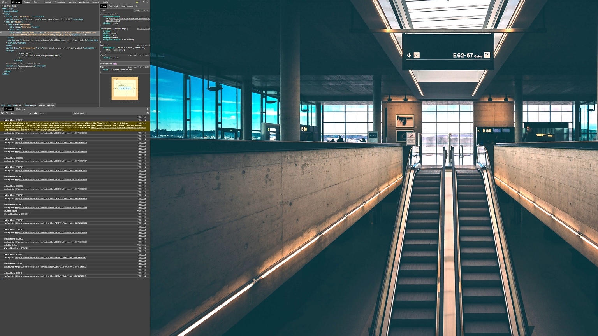

# Description

This app loads random images from specified Unsplash collections. It's crafted to display 4K images fullscreen.  

I personally use this to display a rotating gallery of curated images running on my TV.  

I've used the pandemic to carve out space for me to finally put the time into it. And I'm doing so in order to brush up on a bit of JS. I know there are better ways of doing some of what's here, and those approaches are folded into the project as I work.

# Working Notes

ATM there seems to be memory leakage that brings my fully capable gaming pc to its knees. Def room for improvement.
